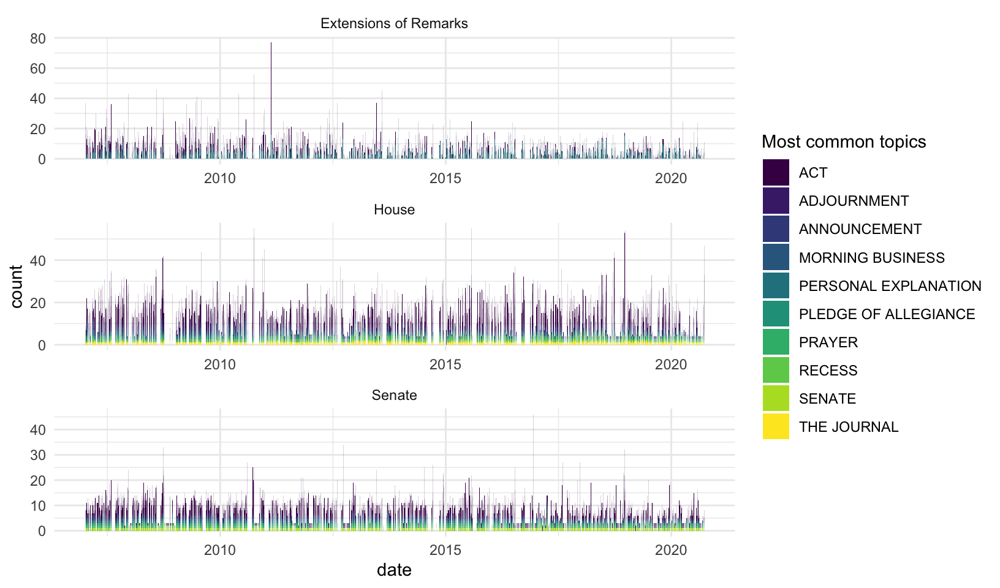

<!-- README.md is generated from README.Rmd. Please edit that file -->

# Scrape, parse, and analyze the Congressional Record 

[](https://CRAN.R-project.org/package=congressionalrecord)

### Installation

    devtools::install_github("judgelord/congressionalrecord")

``` r
library(congressionalrecord)
```

This package depends on the `legislators` package to match legislators
to their ICPSR/voteview id numbers.

    devtools::install_github("judgelord/legislators")

``` r
library(legislators)
```

# Usage

This package contains functions to do three things: (1) scrape, (2)
parse, and (3) analyze the Congressional Record

### 1. Scrape metadata from congress.gov and download the text of the Congressional Record

There are two main scraper functions to (1) scrape metadata on sections
of the record (e.g. “house-section” or “sentate-section”), including
URLs to the raw text for that section and then (2) save them as htm
files in a directory.

`get_cr_df()` first scrapes metadata for all subsections for each day of
the record, including headers and links to the raw text.

``` r
cr_metadata <- get_cr_df(as.Date("2007/03/01"), section = "senate-section")
```

    #> 2007-03-01

``` r
cr_metadata
```

    #> # A tibble: 55 × 4
    #>    header                                                                             date       section        url                                                                                     
    #>    <chr>                                                                              <date>     <chr>          <chr>                                                                                   
    #>  1 Senate; Congressional Record Vol. 153, No. 35                                      2007-03-01 senate-section https://www.congress.gov/congressional-record/volume-153/issue-35/senate-section/articl…
    #>  2 prayer; Congressional Record Vol. 153, No. 35                                      2007-03-01 senate-section https://www.congress.gov/congressional-record/volume-153/issue-35/senate-section/articl…
    #>  3 PLEDGE OF ALLEGIANCE; Congressional Record Vol. 153, No. 35                        2007-03-01 senate-section https://www.congress.gov/congressional-record/volume-153/issue-35/senate-section/articl…
    #>  4 APPOINTMENT OF ACTING PRESIDENT PRO TEMPORE; Congressional Record Vol. 153, No. 35 2007-03-01 senate-section https://www.congress.gov/congressional-record/volume-153/issue-35/senate-section/articl…
    #>  5 RECOGNITION OF THE MAJORITY LEADER; Congressional Record Vol. 153, No. 35          2007-03-01 senate-section https://www.congress.gov/congressional-record/volume-153/issue-35/senate-section/articl…
    #>  6 SCHEDULE; Congressional Record Vol. 153, No. 35                                    2007-03-01 senate-section https://www.congress.gov/congressional-record/volume-153/issue-35/senate-section/articl…
    #>  7 RESERVATION OF LEADER TIME; Congressional Record Vol. 153, No. 35                  2007-03-01 senate-section https://www.congress.gov/congressional-record/volume-153/issue-35/senate-section/articl…
    #>  8 MORNING BUSINESS; Congressional Record Vol. 153, No. 35                            2007-03-01 senate-section https://www.congress.gov/congressional-record/volume-153/issue-35/senate-section/articl…
    #>  9 TSA; Congressional Record Vol. 153, No. 35                                         2007-03-01 senate-section https://www.congress.gov/congressional-record/volume-153/issue-35/senate-section/articl…
    #> 10 FDA REGULATION OF TOBACCO; Congressional Record Vol. 153, No. 35                   2007-03-01 senate-section https://www.congress.gov/congressional-record/volume-153/issue-35/senate-section/articl…
    #> # … with 45 more rows

Scraper methods are described
[here](https://judgelord.github.io/congressionalrecord/scraper.html)
along with code for tables and figures to summarize theese metadata



Crucial for second next step, these metadata include the URL to the full
text. We could download it in PDF or HTML, but those formats take up
more space than plain text without adding much value. (Indeed, PDFs are
harder to work with.)

Paste one of these URLs into your browser and click on “View TXT in new
window” to see what we will be downloading:

``` r
# URL to raw text .htm
head(cr_metadata$url)
```

    #> [1] "https://www.congress.gov/congressional-record/volume-153/issue-35/senate-section/article/S2437-1"
    #> [2] "https://www.congress.gov/congressional-record/volume-153/issue-35/senate-section/article/S2437-2"
    #> [3] "https://www.congress.gov/congressional-record/volume-153/issue-35/senate-section/article/S2437-3"
    #> [4] "https://www.congress.gov/congressional-record/volume-153/issue-35/senate-section/article/S2437-4"
    #> [5] "https://www.congress.gov/congressional-record/volume-153/issue-35/senate-section/article/S2437-5"
    #> [6] "https://www.congress.gov/congressional-record/volume-153/issue-35/senate-section/article/S2437-6"

`get_cr_htm()` then downloads the raw text of each subsection as a .htm
file. By default, `get_cr_htm()` downloads to a “data/htm” directory. In
future versions, users will be able to provide a different location to
the `directory` argument.

``` r
# download raw text .htm file
get_cr_htm(cr_metadata$url[1])
```

    #> Navigating to /110/crec/2007/03/01/modified/CREC-2007-03-01-pt1-PgS2437.htm

``` r
# this is what the raw text file "data/htm/CREC-2007-03-01-pt1-PgS2437.htm" looks like
readLines(here::here("data", "htm", "CREC-2007-03-01-pt1-PgS2437.htm")) 
```

    #>  [1] "<!DOCTYPE html PUBLIC \"-//W3C//DTD HTML 4.0 Transitional//EN\" \"http://www.w3.org/TR/REC-html40/loose.dtd\">"                
    #>  [2] "<html><body><pre>"                                                                                                             
    #>  [3] ""                                                                                                                              
    #>  [4] ""                                                                                                                              
    #>  [5] "[Page S2437]"                                                                                                                  
    #>  [6] "From the Congressional Record Online through the Government Publishing Office [<a href=\"http://www.gpo.gov\">www.gpo.gov</a>]"
    #>  [7] ""                                                                                                                              
    #>  [8] "[[Page S2437]]"                                                                                                                
    #>  [9] ""                                                                                                                              
    #> [10] "-----------------------------------------------------------------------"                                                       
    #> [11] ""                                                                                                                              
    #> [12] "                                 Senate"                                                                                       
    #> [13] ""                                                                                                                              
    #> [14] "  The Senate met at 9:30 a.m. and was called to order by the Honorable "                                                       
    #> [15] "Robert P. Casey, Jr., a Senator from the State of Pennsylvania."                                                               
    #> [16] "                                 ______"                                                                                       
    #> [17] "                                 "                                                                                             
    #> [18] ""                                                                                                                              
    #> [19] ""                                                                                                                              
    #> [20] ""                                                                                                                              
    #> [21] "</pre></body></html>"

### 2. Parse the record into .txt files by speaker

-   The next set of functions to parse htm sections of the record by
    speaker and tag members with their ICPSR ID numbers. By default,
    `parse_cr()` will parse all htm files in the “data/htm” directory
    for dates that do not already appear in a “data/txt” directory. You
    may specify a custom vector of `dates` or `skip_parsed = FALSE` if
    you don’t want to skipped files already parsed.
-   the parser methods are explained
    [here](https://judgelord.github.io/congressionalrecord/speakers)

``` r
# default location where txt files will be saved
directory <- here::here("data", "txt")

# parse congressional record htm files by speaker
parse_cr()
```

    #> 2007-03-01

    #> Typos fixed in 18 seconds

    #> Searching  data for members of the 110th, n = 1208 (324 distinct strings).

    #> Names matched in 8 seconds

    #> Joining, by = c("congress", "pattern", "first_name", "last_name")

``` r
parsed_cr <- list.files(directory, recursive = T)

head(parsed_cr)
```

    #> [1] "2007/10713/CREC-2007-03-01-pt1-PgE444-000140-10713.txt"    "2007/10713/CREC-2007-03-01-pt1-PgE444-000141-10713.txt"    "2007/10713/CREC-2007-03-01-pt1-PgH2118-000715-10713.txt"  
    #> [4] "2007/10808/CREC-2007-03-01-pt1-PgH2043-3-000397-10808.txt" "2007/10808/CREC-2007-03-01-pt1-PgS2460-2-000940-10808.txt" "2007/10808/CREC-2007-03-01-pt1-PgS2487-6-001014-10808.txt"

-   the parsed .txt directory looks like this:


Speeches by John Conyers are in folder “10713” (his ICPSR number)

``` r
readLines(here::here(directory, parsed_cr[1])) 
```

    #> [1] "HON. JOHN CONYERS ::: , JR. of michigan in the house of representatives Thursday, March 1, 2007 "

``` r
readLines(here::here(directory, parsed_cr[2])) 
```

    #> [1] "Mr. CONYERS ::: . Madam Speaker, I am pleased to join with Representative Rahm Emanuel in jointly introducing the Deceptive Practices and Voter Intimidation Prevention Act. America's election system is broken and it is up to this Congress to fix it. Consecutive elections have shown us that eligible voters are denied their right to cast a ballot. Disturbingly, misinformation campaigns are often responsible for keeping these voters away from the polls. I believe this legislation is a step towards ending deceptive practices and bringing integrity back to our elections. It is a direct response to the fraudulent tactics used to undermine our elections. This bill explicitly prohibits deceptive practices and provides voters with greater federal protections. Numerous accounts indicate deceptive practices were employed throughout the country in our last midterm and presidential elections. Voters were told to vote on the wrong day. They were told they could not vote with outstanding parking tickets. Ultimately, they were misled, deceived, and disenfranchised. This must stop. In 2006, our most vulnerable voters--legal immigrants and minorities--were prevented from voting. Latino voters in Orange County, California were threatened with incarceration if they voted. African American voters in Prince Georges County, Maryland were given fliers with false endorsements. These tactics are despicable and those responsible for them must be held accountable. Under our legislation, those that engage in deceptive practices will be held accountable. Additionally, the federal government will be held responsible for protecting and advancing the right to vote. Deceptive electioneering practices are clearly defined and prohibited under this bill. The Attorney General and the Department of Justice are required to combat and counteract deceptive practices. These measures will ensure that voters can cast a ballot free from intimidation, harassment, and deceit. Deceptive practices do more than impede the right to vote. They threaten to erode the very core of our democracy. By eliminating barriers to the polls, we can help to restore what has been missing from our elections--fairness, honesty, and integrity. ____________________ </pre></body></html>"

``` r
readLines(here::here(directory, parsed_cr[3])) 
```

    #> [1] "Mr. CONYERS ::: : Committee on the Judiciary. H.R. 137. A bill to amend title 18, United States Code, to strengthen prohibitions against animal fighting, and for other purposes; with an amendment (Rept. 110-27 Pt. 1). Ordered to be printed. discharge of committee Pursuant to clause 2 of rule XII, the Committee on Agriculture discharged from further consideration. H.R. 137 referred to the Committee of the Whole House on the State of the Union, and ordered to be printed. ____________________ </pre></body></html>"

Speeches by Ted Kennedy are in folder “10808” (his ICPSR number)

``` r
readLines(here::here(directory, parsed_cr[4])) 
```

    #> [1] "Mr. KENNEDY ::: . Madam Chairman, today, the House of Representatives took a long awaited step toward improving the lives of America's working- class and middle-class families. For far too long, the playing field has been tilted against workers and the unions that represent them. Today's House passage of the Employee Free Choice Act, which I strongly supported, will help balance the inequity in the relationship between management and workers; an inequity that management has far too often used to stifle the will of workers. An objective review of the recent history of labor relations in this country shows that in the majority of cases employer coercion, intimidation, and harassment have been used as tools to manipulate and successfully thwart union organizing drives. Workers are often fired or otherwise discriminated against because of their efforts to organize. One out of every four employers illegally fire at least one worker for union activity during an organizing campaign; 78 percent of employers force their employees to attend one- on-one meetings with their supervisors to hear anti-union messages; and 92 percent force employees to attend mandatory, captive audience anti- union meetings. Clearly, even when a solid majority of employees have requested employer recognition of union representation, the more likely reaction of management has been to launch repressive anti-union campaigns rife with illegal tactics. During the minority party's 12 years of power in Congress, and now 6 years in the White House, case after case of illegal employer intimidation leveled against union organizing efforts would arise. That little was often done in response only encouraged impunity among the forces opposed to negotiating with workers in good faith. Now, is the Democratic Party's turn to hold the reins of power in this institution, and with this legislation, the Democratic majority demonstrates its unyielding commitment to workers' rights and a decent life for all working Americans and their families. "

-   `count_speeches.R` contains additional methods to count speeches per
    member that will be included in future versions of
    `congressionalrecord`
-   summary tables and figures of speech counts are
    [here](https://judgelord.github.io/cr/summary.html)

------------------------------------------------------------------------

### 3. Count and extract sentences that contain user-specified phrases

-   Preliminary work on feature extraction is
    [here](https://judgelord.github.io/cr/features)  
-   There is also a brief tutorial on feature extraction at the end of
    the scraper vignette
    [here](https://judgelord.github.io/congressionalrecord/scraper.html#Text_features)


### Notes about these data and methods

Notes about the parser

-   The parser inserts “:::” after the speaker’s name in the parsed text
    to make them easy to extract.
-   Parsed speeches include where members introduce legislation into the
    record. These are actually read by the clerk (beginning with the
    string “The Clerk read the title of the bill.”), but I decided to
    keep them associated with the member who introduced them.
-   The introduction of speakers to the floor appear as separate
    “speeches.” Most all analyses will delete these and other
    super-short texts that are procedural things like “I yield back.”
    Introductions in the parsed text look like this: “HON. JOHN D.
    DINGELL ::: of Michigan in the house of representatives”–notably
    these intros contain state names.
-   Occasionally, when a speaker makes a long speech, GPO divides it
    into subsections that don’t have the speaker’s name on the page
    (either in html or pdf). (For example, [this
    speech](https://www.congress.gov/congressional-record/2020/12/17/senate-section/article/S7563-8)
    by Senator Durbin). These get parsed as “headers” but are much
    longer than the typical header and are thus easy to identify. In the
    next version of the parser or some post hoc correction, I hope to
    re-attach these to the earlier pages of the speech.

### Other notes

Hein-bound data

-   Before deciding to scrape and parse the record from scratch, I tried
    to use existing speech data from Hein bound. Unfortunately, these
    data are incomplete and have a few errors. Most notably, they do not
    retain the date of the speech. My notes on these data and code to
    merge them with voteview data
    [here](https://judgelord.github.io/cr/member_data). A few plots
    comparing Hein-bound speech counts to NOMINATE scores and vote share
    are [here](https://judgelord.github.io/cr/speeches)

## To Do

-   [x] Exclude prayer, the pledge, the journal, resignation,
    adjournment, executive communications, announcements,
    communications, appointment, reappointment, recess, recall,
    designations, additional sponsors, and other proceedural sections.
    (These texts are parsed and saved in the “NA” folder.)

-   [x] Parse sections with more than one speaker, starting with
    “\[SPEAKER NAME\]. (Mister\|Madam) Speaker,”. For example, see the
    Impeachment speaches, where speakers yield time to other speakers.

-   [ ] Check members with irregular capitalization beyond
    “Mc\|Mac\|Des\|De\|La”

-   [x] Match speaker names to ICPSR IDs like I did
    [here](https://judgelord.github.io/cr/speeches) for the hein-bound
    data using the crosswalk crated
    [here](https://judgelord.github.io/cr/member_data.html).

-   [ ] File bug report for names to fix in `legislators` package: Susan
    *W.* Brrooks
