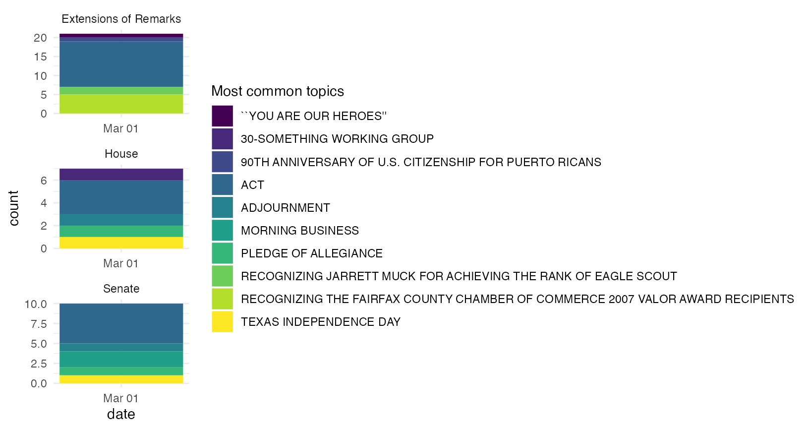
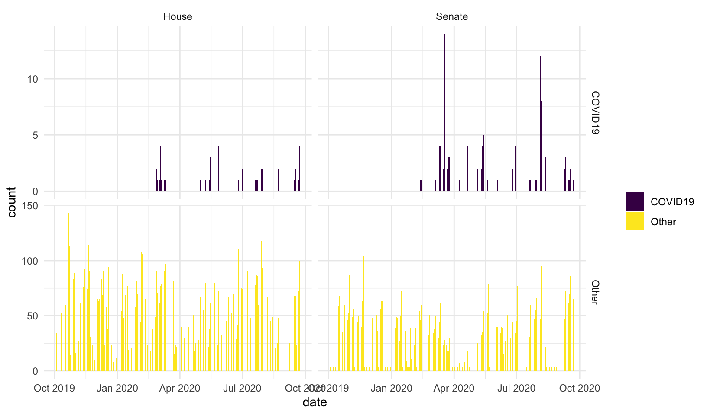

<!-- README.md is generated from README.Rmd. Please edit that file -->

# Scrape, parse, and analyze the Congressional Record


### Installation

    devtools::install_github("judgelord/congressionalrecord")

``` r
library(congressionalrecord)
```

This package depends on the `legislators` package to match legislators
to their ICPSR/voteview id numbers.

    devtools::install_github("judgelord/legislators")

``` r
library(legislators)
```

# Usage

This package contains functions to do three things:

### 1. Scrape the text of the congressional record and metadata from congress.gov

-   `scraper.R` contains functions to scrape sections of the record and
    save them as htm files in a directory. `get_cr_df()` first scrapes
    metadata for all subsections for each day of the record, including
    headers and links to the raw text. `get_cr_htm()` then downloads the
    raw text of each subsection as a .htm file to a “data/htm”
    directory.
-   scraper methods are described
    [here](https://judgelord.github.io/congressionalrecord/scraper.html)

``` r
cr_metadata <- get_cr_df(as.Date("2007/03/01"), section = "senate-section")
```

    #> 2007-03-01

``` r
cr_metadata
```

    #> # A tibble: 55 × 4
    #>    header                                                                             date       section        url                                                                                     
    #>    <chr>                                                                              <date>     <chr>          <chr>                                                                                   
    #>  1 Senate; Congressional Record Vol. 153, No. 35                                      2007-03-01 senate-section https://www.congress.gov/congressional-record/volume-153/issue-35/senate-section/articl…
    #>  2 prayer; Congressional Record Vol. 153, No. 35                                      2007-03-01 senate-section https://www.congress.gov/congressional-record/volume-153/issue-35/senate-section/articl…
    #>  3 PLEDGE OF ALLEGIANCE; Congressional Record Vol. 153, No. 35                        2007-03-01 senate-section https://www.congress.gov/congressional-record/volume-153/issue-35/senate-section/articl…
    #>  4 APPOINTMENT OF ACTING PRESIDENT PRO TEMPORE; Congressional Record Vol. 153, No. 35 2007-03-01 senate-section https://www.congress.gov/congressional-record/volume-153/issue-35/senate-section/articl…
    #>  5 RECOGNITION OF THE MAJORITY LEADER; Congressional Record Vol. 153, No. 35          2007-03-01 senate-section https://www.congress.gov/congressional-record/volume-153/issue-35/senate-section/articl…
    #>  6 SCHEDULE; Congressional Record Vol. 153, No. 35                                    2007-03-01 senate-section https://www.congress.gov/congressional-record/volume-153/issue-35/senate-section/articl…
    #>  7 RESERVATION OF LEADER TIME; Congressional Record Vol. 153, No. 35                  2007-03-01 senate-section https://www.congress.gov/congressional-record/volume-153/issue-35/senate-section/articl…
    #>  8 MORNING BUSINESS; Congressional Record Vol. 153, No. 35                            2007-03-01 senate-section https://www.congress.gov/congressional-record/volume-153/issue-35/senate-section/articl…
    #>  9 TSA; Congressional Record Vol. 153, No. 35                                         2007-03-01 senate-section https://www.congress.gov/congressional-record/volume-153/issue-35/senate-section/articl…
    #> 10 FDA REGULATION OF TOBACCO; Congressional Record Vol. 153, No. 35                   2007-03-01 senate-section https://www.congress.gov/congressional-record/volume-153/issue-35/senate-section/articl…
    #> # … with 45 more rows

``` r
cr_metadata$url[1]
```

    #> [1] "https://www.congress.gov/congressional-record/volume-153/issue-35/senate-section/article/S2437-1"

``` r
get_cr_htm(cr_metadata$url[1])
```

    #> Navigating to /110/crec/2007/03/01/modified/CREC-2007-03-01-pt1-PgS2437.htm

``` r
read_html(here::here("data", "htm", "CREC-2007-03-01-pt1-PgS2437.htm")) 
```

    #> {html_document}
    #> <html>
    #> [1] <body><pre>\n\n\n[Page S2437]\nFrom the Congressional Record Online through the Government Publishing Office [<a href="http://www.gpo.gov">www.gpo.gov</a>]\n\n[[Page S2437]]\n\n---------------- ...



### 2. Parse the record into .txt files by speaker

-   `parser.R` contains functions to parse htm sections of the record by
    speaker and tag members with their ICPSR ID numbers. By default,
    `parse_cr()` will parse all htm files in the “data/htm” directory
    for dates that do not already appear in a “data/txt” directory. You
    may specify a custom vector of `dates` or `skip_parsed = FALSE` if
    you don’t want to skipped files already parsed.
-   the parser methods are explained
    [here](https://judgelord.github.io/congressionalrecord/speakers)
-   `count_speeches.R` contains methods to count speeches per member
-   summary tables and figures of speech counts are
    [here](https://judgelord.github.io/cr/summary.html)
-   the parsed .txt directory looks like this:


``` r
# default location where txt files will be saved
directory <- here::here("data", "txt")

# parse congressional record htm files by speaker
parse_cr()
```

    #> 2007-03-01

    #> Typos fixed in 18 seconds

    #> Searching  data for members of the 110th, n = 1208 (324 distinct strings).

    #> Names matched in 9 seconds

    #> Joining, by = c("congress", "pattern", "first_name", "last_name")

``` r
parsed_cr <- list.files(directory, recursive = T) |> head()

parsed_cr
```

    #> [1] "2007/10713/CREC-2007-03-01-pt1-PgE444-000140-10713.txt"    "2007/10713/CREC-2007-03-01-pt1-PgE444-000141-10713.txt"    "2007/10713/CREC-2007-03-01-pt1-PgH2118-000715-10713.txt"  
    #> [4] "2007/10808/CREC-2007-03-01-pt1-PgH2043-3-000397-10808.txt" "2007/10808/CREC-2007-03-01-pt1-PgS2460-2-000940-10808.txt" "2007/10808/CREC-2007-03-01-pt1-PgS2487-6-001014-10808.txt"

``` r
readLines(here::here(directory, parsed_cr[1])) 
```

    #> [1] "HON. JOHN CONYERS ::: , JR. of michigan in the house of representatives Thursday, March 1, 2007 "

Speeches by John Conyers are in folder “10713” (his ICPSR number).

------------------------------------------------------------------------

### 3. Count and extract sentences that contain user-specified phrases

-   Preliminary work on feature extraction is
    [here](https://judgelord.github.io/cr/features)  
-   There is also a brief tutorial on feature extraction at the end of
    the scraper docs
    [here](https://judgelord.github.io/congressionalrecord/scraper.html#Text_features)



### Notes about these data and methods

Notes about the parser

-   The parser inserts “:::” after the speaker’s name in the parsed text
    to make them easy to extract.
-   Parsed speeches include where members introduce legislation into the
    record. These are actually read by the clerk (beginning with the
    string “The Clerk read the title of the bill.”), but I decided to
    keep them associated with the member who introduced them.
-   The introduction of speakers to the floor appear as separate
    “speeches.” Most all analyses will delete these and other
    super-short texts that are procedural things like “I yield back.”
    Introductions in the parsed text look like this: “HON. JOHN D.
    DINGELL ::: of Michigan in the house of representatives”–notably
    these intros contain state names.
-   Occasionally, when a speaker makes a long speech, GPO divides it
    into subsections that don’t have the speaker’s name on the page
    (either in html or pdf). (For example, [this
    speech](https://www.congress.gov/congressional-record/2020/12/17/senate-section/article/S7563-8)
    by Senator Durbin). These get parsed as “headers” but are much
    longer than the typical header and are thus easy to identify. In the
    next version of the parser or some post hoc correction, I hope to
    re-attach these to the earlier pages of the speech.

### Other notes

Hein-bound data

-   Before deciding to scrape and parse the record from scratch, I tried
    to use existing speech data from Hein bound. Unfortunately, these
    data are incomplete and have a few errors. Most notably, they do not
    retain the date of the speech. My notes on these data and code to
    merge them with voteview data
    [here](https://judgelord.github.io/cr/member_data). A few plots
    comparing Hein-bound speech counts to NOMINATE scores and vote share
    are [here](https://judgelord.github.io/cr/speeches)

## To Do

-   [x] Exclude prayer, the pledge, the journal, resignation,
    adjournment, executive communications, announcements,
    communications, appointment, reappointment, recess, recall,
    designations, additional sponsors, and other proceedural sections.
    (These texts are parsed and saved in the “NA” folder.)

-   [x] Parse sections with more than one speaker, starting with
    “\[SPEAKER NAME\]. (Mister\|Madam) Speaker,”. For example, see the
    Impeachment speaches, where speakers yield time to other speakers.

-   [ ] Check members with irregular capitalization beyond
    “Mc\|Mac\|Des\|De\|La”

-   [x] Match speaker names to ICPSR IDs like I did
    [here](https://judgelord.github.io/cr/speeches) for the hein-bound
    data using the crosswalk crated
    [here](https://judgelord.github.io/cr/member_data.html).

-   [ ] File bug report for names to fix in `legislators` package: Susan
    *W.* Brrooks
